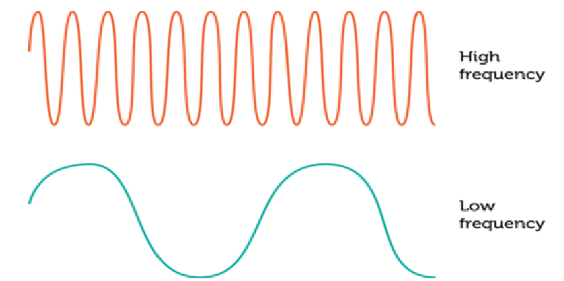
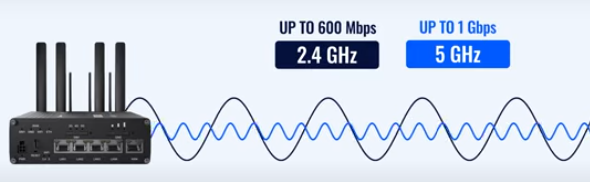
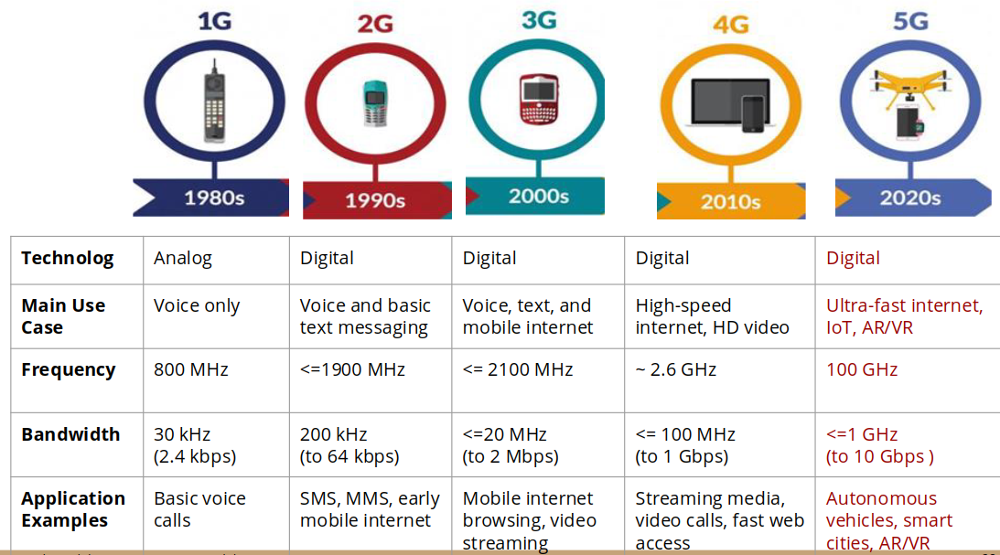
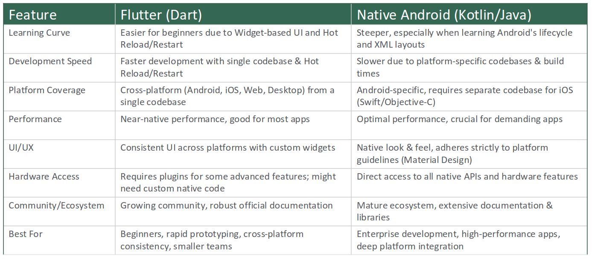
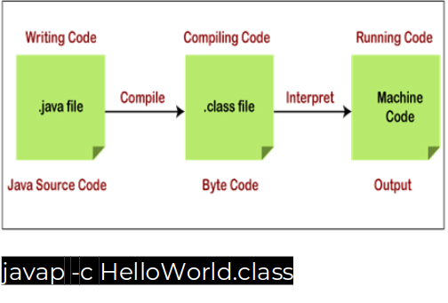

# Part 1 - Introduction
## What is Mobile Computing?
=>the process of **distributed computation** (in more than one device and also connected with servers) on diversified mobile devices connected through **cellular and wireless network** using **standard internet communication protocols.**

## How Communication Happens?
### Mechanical Waves
=> Require a medium (solid, liquid, or gas), ex: sound waves, water waves
### Electromagnetic Waves
=> used in mobile communication (wireless communication)
=> not require a medium
=> ex: Radio waves, microwaves, infrared, visible light, ultraviolet, X-rays, and gamma rays.

### Terminologies
#### Frequency
=> the number of occurrences of a repeating event per unit of time
=> measured in hertz(Hz)

**Low Freq Vs High Freq**

=> Low Frequency travel father and penetrate walls better
=> Higher frequency carry more about data but cover shorter distances and not good when there is closed area
- watch this video for more info(~2m) and is the source of photos above: [2.4 vs 5 GHz Wi-Fi: What's the Difference? - YouTube](https://youtu.be/TRL-o6N8brE)

**The evolution of mobile network technology through its five generations**

# Part 2 - Android
## Why Android?
1. Market Demand
2. Diverse Opportunities: doors to various roles
3. Learning Resources
4. Integration with other technologies
## Android VS Flutter

## Why Java
1. Versatility
2. Platform Independence: run in any device that has Java Virtual Machine (JVM)
3. Strong Communicty Support
4. Object-Oriented Programming (OOP)
5. Robustness and Security: strong memory management and security feature
6. Enterprise-Level Applications
7. In nutshell 

## Compiler VS Interpreter

| Compler                                                                                                                                                                       | Interpreter                                                                                                                                                                          |
| ----------------------------------------------------------------------------------------------------------------------------------------------------------------------------- | ------------------------------------------------------------------------------------------------------------------------------------------------------------------------------------ |
| - Translate entire source code to machine code - output is an executable file that can be run independently of the original source code. - Faster - ex: C, C++, Rust | - translates source code line-by-line or statement-by-statement at runtime, executing it immediately. - no executable file generated - slower at runtime - Python, ruby, JS |

> **Java Behavior:**

1. Compile source code -> bytecode
2. bytecode is analogous to machine code but run with virtual machine for the host hardware (Linux, windows,..etc)
## Android Platform Architecture
=> Android is an open source, Linux-based software stack.
=> to access kernel of the phone : use Android Debug Bridge (**adb**) or Debug Bridge Enhanced (**adb-enhanced**).
### 1. Linux Kernel 
-  relies on underlying functionalities of the kernel
	- Threading
	- low level memory management (shared memory)

> **Advantage to use linux:** security features and lets device manufacturers develop hardware drivers for a well-known kernel.

> **Commands:**

- `brew install adb` -> to access kernel 
- `adb shell` -> access the kernel shell
- `uname -r` -> kernel version
- `uname -a` -> logs
- `cat /proc/cpuinfo` -> cpu info
- `cat /proc/meminfo` -> memory info
- `top` -> memory and cpu usage (like task manager in windows)
- `iostat` -> I/O statistics

### 2. HAL (Hardware Abstraction Layer)
- function: expose device hardware capabilities to the higher level Java API framework.
	- Bluetooth module
	- the camera
	- Audio
- when a framework API makes a call to access device hardware, the Android system loads the library module for that hardware component.

> To interact with hardware components via the HAL use the services via adb shell. commands:

- `service list`: to list all services
- `service call audio <command>`: to call specific service

### 3. Android Runtime (ART)
- Android version 5 and higher -> runs its own process with its own instance of the Android runtime (ART).
- ART Run Dalvik executable format (DEX) files.
- DEX: 
	- **d8** tool compile Java sources into DEX bytecode
	- DEX is a bytecode format specifically for Andriod

### 4. Native C/C++ Libraries
- ART and HAL, built from native code required native C and C++ libraries.
- to access these native libraries directly in android -> use the Android NDK (Native Development Kit)

### 5. Java API Framework
=> The entire feature-set of the Android Os available through APIs written in the java language.
> some of modular system components and services that are provided by Java API Framework

- **View System:** building the app's **user interface** (UI)—all the buttons, text boxes, and screens.
- **Resource Manager:** manage **non-code parts**, like images, layout files, and text strings for different languages.
- **Notification Manager:** lets your app **create notifications** in the phone's status bar.
- **Activity Manager:** manages the app's **lifecycle** (when it opens, closes, or goes to the background) and the back stack (what happens when you press the "back" button).
- **Content Providers:** **sharing data** between apps, like how your app asks for permission to read the phone's main contact list.
### System Apps
- **What They Are:** These are the core, preinstalled apps that come with Android, such as the Email, Calendar, and Camera.
- **No Special Status:** This means that third- party app can become the user's default web browser, SMS messenger.
- These apps have **two functions**:
    - Apps for the user.
    - Provide core services that other developers can use. For example, using SMS feature, a developer can have their app "invoke" for installed SMS app to send a message.

# Quiz

## **Choice**

## **Questions:**

**Answer:**
- The app spawns too many services => high CPU usage and increased memory consumption.
- ART now has to manage more active processes and garbage collection cycles.
- This increases execution overhead for the main navigation process.
- The Location System Service must deliver GPS updates to your app.
- With the CPU and memory under pressure, service callbacks are delayed.
- The HAL’s GPS module still provides fresh location data, but the app is late in receiving and processing it.
- The same happens with the Audio HAL when sending voice instructions.
- The driver experiences lag in location updates (map position jumps instead of moving smoothly).
- Voice guidance is delayed, making directions less reliable.

Observe here that in this scenario the HAL still provides fresh data, why?

The HAL (Hardware Abstraction Layer) in Android is a thin translation layer between hardware drivers (e.g., GPS chip, audio chip) and higher-level Android system services.
The GPS hardware module has its own dedicated chip + firmware. It continues to track satellites and calculate positions independently of your app’s CPU load.
So even if the CPU is overloaded, the GPS chip itself is still happily cranking out fresh fixes (e.g., a new latitude/longitude every second).

**Answer:**
1. **Increased RAM Usage:** When the app starts, this large `.dex` file (and its compiled version, the `.oat` file) is loaded into the phone's **RAM**, consuming a large, unnecessary amount of memory.
2. **Increased CPU Usage (The Culprit):**
    - Unoptimized code creates far more temporary "garbage" objects.
    - This forces the **Android Runtime (ART)** to run its **Garbage Collector (GC)** much more frequently.
3. **Resource Competition:**
    - **CPU Fight:** The **video decoding** (a very CPU-heavy task) is competing for time with the **Garbage Collector** (also a CPU-heavy task).
    - **RAM Fight:** The **video buffer** (which needs a large chunk of RAM to stream smoothly) is competing for space with the **bloated app code**.
4. **The Result: Laggy Stream:**
    - **Stuttering:** When the Garbage Collector pauses the app, the video decoder can't prepare the next frame in time. This causes the video to freeze or stutter.
    - **Buffering:** Because RAM is low, the app can't create a large-enough video buffer. If there is even a small hiccup on the Wi-Fi network, the small buffer runs out instantly, and the user is forced to wait (lag) while it refills.