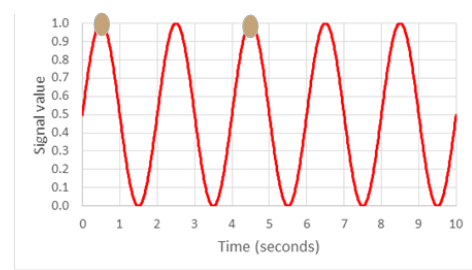
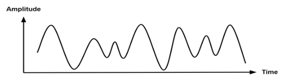
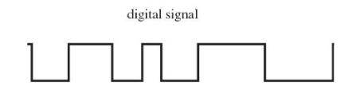

# Foundational Part
## Terminologies
### Frequency
-> same as lecture 1
**Can the electric and the magnetic waves each have a different frequency in the same wave?**
- They are always linked together — when the electric field oscillates, the magnetic field oscillates too. • Both fields must have the same frequency because they are generated by the same source and keep each other going as the wave travels. 

### Crest, Through, Wavelength, Amplitude

### Phase 
=> Specifies the location or timing of a point within a wave

### Network Terminologies
#### Bandwidth (rate)
=> the maximum rate of data transfer across a given path, a theoretical limit
#### Throughput (rate)
=> Throughput is the actual data transfer rate experienced during use.
#### Latency
=> the time it takes for data to travel from the source (sender) to the destination (receiver) and back.
=>  some times called ping or lag in certain contexts.
=> Low latency: faster response, good for videos, streaming, calls
=> High latency: delay, might be a gap between speaking and hearing the response.
## Signal Modulation
### Types of Signals
#### Analog Signal
- Accurate, continuous waveform
- It varies smoothly over time and can take any value within a given range, ex: sound waves, light, temperature.
- Pros: Natural Representation, Simplicity, Higher Resolution (accurate)
- cons: Noise Sensitivity, Requires large space.

#### Digital Signal
- Discrete values or levels
- binary numbers (0 and 1)
- ex: audio, computer data, digital images
- Pros: Noise Immunity, Compression, Storage and Processing, Error Detection.
- Cons: Sampling Error, Quantization, Complexity 

### Modulation 
=> the process of varying one or more properties of a periodic waveform, called the carrier signal, with a separate signal called the modulation signal that typically contains information to be transmitted. 
### Demodulation
=> the process of removing the modulation from a carrier signal to retrieve the original information or message that was encoded into the signal

### Modem
- Short for modulator-demodulator
- It performs modulation and demodulation of signals.
### Analog Modulation
#### Amplitude Modulation (AM)
- the change in the amplitude of the wave is varied in proportion to that of the message signal, such as an audio signal.

#### Frequency Modulation (FM)
- the encoding of information in a carrier wave by changing the instantaneous frequency of the wave

#### Phase Modulation (PM)

- the amplitude and frequency are constant
- The phase of a carrier signal is modulated to follow the changing signal level (amplitude) of the message signal.
### Modulation of Digital Signals
#### Amplitude Shift Keying (ASK)

#### Frequency Shift Keying (FSK)

#### Phase Shift Keying (PSK)

# Practical Part
## Build Tools & Gradle
**Build Tools:** Make, Ant, Maven, Gradle
### Gradle
**Features**
1. Incremental Builds: 
	- Complex projects often run into slow build times as the build tool tries to “clean” and rebuild everything. Gradle addresses this problem by providing incremental builds that skip the execution of a task if neither the inputs nor the outputs have changed. 
2. Gradle Wrapper:
	- Is batch file (`gradlew.bat`) in the Windows environment and a shell script for Linux/Mac environments. When it runs, the wrapper script downloads and installs a fresh copy of Gradle runtime on the machine and executes a Gradle build.
	- The wrapper also makes it easy to distribute code and collaborate with others, as the recipients can easily build it.
3. Plugins:
	- These are distributable components that encapsulate reusable build and task logic.
	- Using plugins, it is possible to support additional languages, create new tasks, or modify existing task functionality and extend build language by adding new keywords.

## Activity

