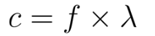
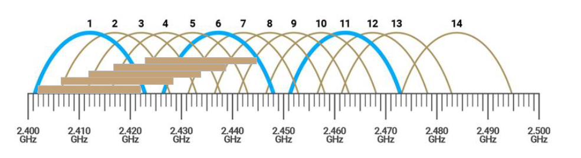
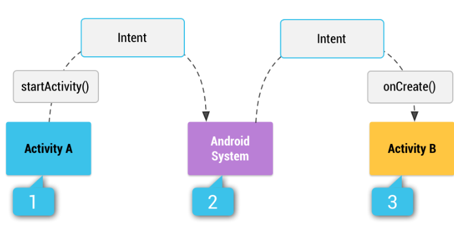

# Communication
## Wavelength and Frequency

1. **Wavelength ($\lambda$)** is defined as the distance between two consecutive peaks or troughs in a wave.
2. **Frequency ($f$)** is the number of wave cycles passing a point per unit of time, measured in Hertz (Hz).
3. The relationship between speed ($c$), frequency ($f$), and wavelength ($\lambda$) is governed by a specific formula. 

4. **Inverse Relationship:** Higher frequency corresponds to a shorter wavelength, and vice versa.

## Wireless Network Classification

Wireless networks are categorized into four main types:

| Network Type                    | Range / Area                                            | Throughput                                                                                | Examples                       | Key Uses                                                      |
| :------------------------------ | :------------------------------------------------------ | :---------------------------------------------------------------------------------------- | :----------------------------- | :------------------------------------------------------------ |
| **Personal Area Network (PAN)** | Short range (typically within a few meters)             | Generally low (typically in Mbps)                                                         | Bluetooth, Infrared, NFC, RFID | Connecting personal devices (smartphones, wearables)          |
| **Local Area Network (LAN)**    | Limited area (home, office, building); up to 100 meters | Varies widely (often 10 Mbps to several Gbps)                                             | Wi-Fi                          | Office/home networking, file sharing                          |
| **Wide Area Network (WAN)**     | (cities/countries); several km to hundreds of km        | Varies based on technology used; often Mbps to hundreds of Mbps (can be slower than LANs) | Cellular network               | Connecting branch offices, data centers, remote locations     |
| **Global Area Network (GAN)**   | Spans multiple countries thousands of kilometers        | N/A                                                                                       | Satellite communications       | Global telecommunications, internet services, cloud computing |

## WiFi (LAN)

### WiFi Definition

- **WiFi (Wireless Fidelity)** is a family of wireless network protocols.
- It is based on the **IEEE 802.11 family of standards**.
- WiFi is commonly used for local area networking and Internet access, enabling digital devices to exchange data via radio waves.

### Wireless Access Point (WAP)

- A **Wireless Access Point (WAP)** or Access Point (AP) is a networking hardware device.
- It allows other Wi-Fi devices to connect to a wired network or wireless network.
- An AP typically connects directly to a wired LAN (usually Ethernet) and provides wireless connections (Wi-Fi) for other devices.

### IEEE 802.11 Standard

- IEEE 802.11 is part of the IEEE 802 set of technical standards for Wireless Local Area Network (WLAN).
- It allows devices (laptops, printers, smartphones) in most home and office networks to communicate without wires and access the Internet.
- The standard uses various frequency bands, including 2.4 GHz, 5 GHz, 6 GHz, and 60 GHz. A band is defined as a range of frequencies.

### Frequency Bands Comparison

#### A. 2.4 GHz Band Details

- The band ranges from **2.401 GHz to 2.4835 GHz** (a total of about 83.5 MHz).
- *divided into sub-bands called channels, which are assigned to Wi-Fi devices.
- **Overlap and Interference:** The band can be divided into 14 overlapping channels. Channels in the 2.4 GHz band are only 5 MHz apart, leading to lots of overlap. Consequently, there are at most **3 non-overlapping channels** within the 2.4 GHz band (e.g., 1, 6, and 11 in the US). Other non-overlapping combinations, such as 2, 7, and 12, also exist.
- It is slower and crowded, but due to its lower frequency, it is generally **better at penetrating through walls**. It has a longer coverage range (~30–45 m indoor).

#### B. 5 GHz Band Details

- **Frequency Range:** The band ranges from 5.150 – 5.825 GHz, totaling about 675 MHz, making it much wider than the 2.4 GHz band.
- The 5 GHz band has **24 non-overlapping channels**
- Each Wi-Fi channel is usually 20 MHz wide. Multiple channels can be combined (20MHz, 40MHz, 80MHz, and 160MHz) to increase the data transmitted simultaneously.
- It is faster, has more channels, and is less crowded. However, due to its higher frequency, it has a **shorter range of coverage** (~10–30 m indoor) and is more susceptible to obstacles (worse wall penetration).

#### C. Modern Routers
Many modern routers are dual-band, supporting both 2.4 GHz and 5 GHz bands, and often include a modem.

----

# Android

### URI (Uniform Resource Identifier)

- **Definition:** URI stands for Uniform Resource Identifier.
- **Purpose:** It is used to represent a resource or action (e.g., a location, phone number, or webpage).
- **Standard:** It follows the universal internet standard (RFC 3986).
- **Structure:** A URI follows the structure: `scheme : // authority / path ? query # fragment`.
- **Common Schemes and Examples:** Schemes include `geo:` (maps), `tel:` (phone number), `sms:` (send SMS), `mailto:` (email), `http/https` (websites), and `content:` (app data/files).

### Intent Definition and Functions

- An **Intent** is a messaging object used to request an action from another app component.
- All Activity instances are managed by the Android runtime and are started by an Intent, which is a message to the runtime to run an activity.

**Intents can perform three main actions:**

1. **Start an Activity:** starting a new Activity for text entry or opening an app to post a photo.
2. **Start a Service:** initiating a background file download.
3. **Deliver Broadcast:** the system informing that the phone is charging.

### Intent Types

| Intent Type         | Specification                                                                                                                                                              | Usage                                                                                             |
| :------------------ | :------------------------------------------------------------------------------------------------------------------------------------------------------------------------- | :------------------------------------------------------------------------------------------------ |
| **Explicit Intent** | Specifies a full Component Name (defines **WHO** should do it). `Intent(this, DetailsActivity::class.java); startActivity(intent)`                                      | Used typically to start a component within your own app, as the class name is known.              |
| **Implicit Intent** | Does not name a specific component (defines **WHAT** needs to be done). `Intent(Intent.ACTION_VIEW, Uri.parse("geo:37.7749,- 122.4194?q=foul")) startActivity(intent) ` | Declares a general action, allowing a capable component from _another app_ to handle the request. |
|                     |                                                                                                                                                                            |                                                                                                   |

### Sending and Receiving Data

1. **Sending Activity:** Creates the Intent, puts data or extras into it, and uses `startActivity()`.
2. **Receiving Activity:** Gets the Intent object and retrieves the data or extras from it.

**Two Types of Data Transfer:**

1. **Data:** A single piece of information whose location can be represented by a **URI**.
    - **Sending:** Set using `intent.setData(Uri.parse("..."))`.
    - **Receiving:** Retrieved using `Uri locationUri = intent.getData();`.

2. **Extras:** One or more pieces of information stored as key-value pairs in a **Bundle**.
    - **Sending:** Set using `intent.putExtra(String name, value)` (e.g., `intent.putExtra("level", 406)`) or using a Bundle and `intent.putExtras(bundle)`.
	    - `Bundle bundle = new Bundle();
	    - `bundle.putInt("level", 406);
	    - `bundle.putStringArray("food", foodList);
	    - `intent.putExtras(bundle);`
    - **Receiving:** Retrieved using specific methods like `int level = intent.getIntExtra("level", 0);` or by retrieving the entire Bundle using `Bundle bundle = intent.getExtras();`.

### Defining Intent Filters (Receiving Intents)

