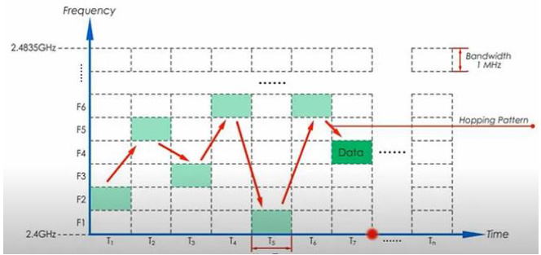

# Bluetooth & PAN

## Personal Area Network (PAN)

A PAN refers to a network established between devices in an individual's immediate surroundings, typically operating within 10 meters. It connects personal devices such as smartphones, tablets, wearables, and IoT gadgets. 
=> Examples Infrared, Radio-Frequency identification (RFID), Near Field Communication (NFC), and **Bluetooth**.

## Bluetooth
=> Bluetooth is a wireless technology standard for exchanging data over short distances using **UHF radio waves**, typically within a PAN.

=> They wanted a short-range, low-power wireless link that could connect devices without consuming as much power as WiFi or requiring complicated setup like infrared (which needed line-of-sight). 

=> Haartsen developed a system utilizing the **2.4 GHz ISM band** (which is globally free to use) and applied **Frequency Hopping Spread Spectrum**.

### Bluetooth Classic

- Refers to versions 1.0 to 3.0.
- For devices that need continuous, short-range data and audio streaming.
- Has high power consumption because the radio is always on, leading to shorter battery life.
- Operates over **79 RF channels** (1 MHz wide); discovery occurs on 32 channels.
- Limited range (up to about 50 m); uses a **peer-to-peer (1:1)** topology.
- High developer cost (sniffers can cost upwards of $20K-$30K); chipset costs are higher (>$10).

#### Bluetooth Communication Networks (Classic)

##### **Piconet:** 
- An ad hoc network linking a wireless group of devices. It involves two or more devices occupying the same physical channel.
- Up to 255 further slave devices can be inactive ("parked") and activated by the master at any time.
- **non-contention based** (no collisions) because each device is assigned a specific, non-overlapping time period to transmit.

##### **Scatternet:**
- consisting of **two or more piconets**.
    - It supports communication between more than eight devices.
    - A scatternet is formed when a device (master or slave) from one piconet participates as a slave in a second, allowing it to relay data between both networks.
    - This approach expands the network's physical size beyond Bluetooth's limited range.

#### Frequency Hopping Spread Spectrum (FHSS)

- FHSS to avoid communication problems like interference, jamming, and interception/hacking.
- **Process:** FHSS transmits radio signals by rapidly changing the carrier frequency among many frequencies within a large spectral band.
- **Control/Synchronization:** The changes are controlled by the **seed of the pseudorandom generator**, which is known to both transmitter and receiver.
    - The **master** determines parameters using its device address (BD_ADDR) and clock as input to the hop-sequence algorithm.
    - The **slave** synchronizes by learning the timing and parameters to compute the exact same deterministic (pseudo-random) sequence. The master controls slot allocation.

#### Adaptive Frequency Hopping (AFH)

- AFH is needed because interference, while minimized by randomness, can still occur in FHSS.
- **Channel Assessment:** The master monitors signal quality, packet errors, or interference statistics on the 79 channels. Channels that are consistently poor are flagged.
- **Bitmask:** AFH maintains a channel map (a 79-bit mask), where '1' signifies a good channel and '0' signifies a bad channel.
- **Skipping:** When the generator selects the next frequency, the master maps it to the nearest usable channel according to the map, skipping bad channels. The sequence remains pseudo-random.
- **Slave Sync:** The slave receives the updated channel map from the master, and both devices use the deterministic algorithm with the updated map to remain synchronized.

### Bluetooth Low Energy (BLE)

- **Objective:** To provide reduced power consumption and cost compared to Classic Bluetooth while maintaining a similar range.
- **Performance:** Lower power consumption, more efficient radio usage, and on-time, enabling longer battery life (up to 3–5 years for some applications).
- **Data Rate:** Max data rate is 2 Mbps (as of v 5.3).
- **Channels:** Operates over **40 RF channels** (2 MHz wide).
- **Range and Topology:** More flexible range configuration, achieving over 1-kilometer line-of-sight using long-range mode (introduced in version 5.0). Supports Peer-to-peer (1:1), Star (many:1), Broadcast (1:many), and Mesh (many:many) topologies.
- **Cost:** Low developer cost (simple sniffers cost about $10); chipset costs are lower, sometimes down to $1–$2.

#### Communication Model

> **Roles:**

1. **Peripheral:** 
	- Usually a small device: sensor, smartwatch, IoT device. 
	- Advertises itself periodically to indicate it’s available for connection. 
	- Low-power operation is key: it only transmits when necessary.
2. **Central:** 
	- Usually a smartphone, tablet, or computer.
	- Scans for advertising peripherals.
	- Initiates the connection and controls the timing once connected. 

> **Establishment:**

1. Advertising (Peripheral → Central)
	- The peripheral sends advertising packets on 3 dedicated advertising channels (37, 38, 39).
	- These packets contain information like device name, UUIDs of services, and whether it’s connectable.
2. Step 2: Scanning (Central → Peripheral)
	- The central continuously scans those 3 advertising channels.
	- When it sees a peripheral it wants to connect to, it sends a connection request on the advertising channel. 
3. Step 3: Connection Request
	- This packet includes parameters like: 
	- Connection interval (how often devices exchange data)
	- Slave latency (how many intervals a peripheral can skip to save power)
	- Connection timeout (maximum time without communication before disconnect)
	- After this, the peripheral switches to the data channels and stops advertising (or may continue advertising depending on configuration).

> **Data Communication:**

1. BLE has 40 channels: 3 advertising channels + 37 data channels. 
2. After the connection is established, the central and peripheral hop between the 37 data channels using a pseudo-random sequence. 
3. Peripheral devices can sleep between intervals. 
4. Slave latency allows a peripheral to skip a number of intervals if no data needs to be sent. 


------


# Android
## Functional Programming Concepts

In Kotlin, almost **everything is an expression and has a value**; even an `if` expression has a value. If an expression doesn't return a meaningful type, its value is `kotlin.Unit`.
```kotlin
val temperature = 20
 val isHot = if (temperature > 40) true else false
  println(isHot) ⇒ false
  
  val isUnit = println("This is an expression") 
  println(isUnit) 
  
```
#### First-Class Functions

Kotlin functions are first-class, meaning they can be:

- Stored in variables and data structures.
- Passed as arguments to other higher-order functions.
- Returned from other higher-order functions.
- Used to create new "built-in" functions.

```kotlin
var dirtLevel = 20
 val waterFilter = {level: Int -> level / 2}
 
  println(waterFilter(dirtLevel))
```

#### Lambdas (Anonymous Functions)

- A lambda is an expression that creates a function with no name.
- **Syntax:** Includes the parameter(s) and type, followed by the function arrow (`->`), and the code to execute. (e.g., `val waterFilter: (Int) -> Int`).

- **Implicit 'it':** If a lambda has only a single parameter, the parameter name and the arrow can be omitted. Kotlin automatically names this single parameter `it`.
```kotlin
val applyDiscount: (Double) -> Double = { it - 5.0 }
```

#### Higher-Order Functions

- Higher-order functions either take functions as parameters or return a function.
- **Passing Named Function References:** The **`::` operator** is used to pass a named function reference as an argument, preventing the function from being called immediately.
``` kotlin
fun encodeMsg(msg: String, encode: (String) -> String): String {
	 return encode(msg) 
}

```
- **Returning Functions:** A function can accept an argument (like a coupon code) and return the appropriate function (discount function). This returned function can be a reference to a named function or a lambda.
```kotlin
// return a lambda 
fun discountForCouponCode(couponCode: String): (Double) -> Double = when (couponCode) {
	 "FIVE_BUCKS" -> { price -> price - 5.0 }
	 "TAKE_10" -> { price -> price * 0.9 }
	  else  -> { price -> price } 
}
```
## Database using Android Room

**Android Room Database** is a powerful persistence library provided by Google that offers an abstraction layer over SQLite to enable robust and fluent database access.

**Benefits of Room:**
- **Compile-time verification** of SQL queries.
- Convenience annotations that minimize repetitive and error-prone boilerplate code.
- Streamlined database migration paths.

#### Key Parts in Android Room

The three key components of the Room persistence library are:

1. **Entities** (database tables).
2. **DAOs** (database operations).
3. The main **Database class**.

#### 1. Entity (Database Tables)


- **Relationships:** Defining relationships between entities involves three steps: defining the parent entity, defining the child entity with a foreign key, and creating a relationship class.


#### 2. Data Access Objects (DAOs)

- A DAO is an interface responsible for providing methods to interact with the database.
- It handles operations such as inserting, querying, updating, and deleting data.
- **Operation Annotations:**
    - **`@Insert`**: Adds data (Create).
    - **`@Query`**: Retrieves data (Read).
    - **`@Update`**: Modifies data (Update).
    - **`@Delete`**: Removes data (Delete).

#### 3. Setting Up and Managing Databases

> 1. Define classes 

- **`@Database` Annotation:** This annotation is mandatory to define the database. It requires specifying two key parameters:
    - **`entities`**: A list of data classes (e.g., `User`) that represent all the tables in the database.
    - **`version`**: The version number of the database schema, which is used to handle migrations if the schema changes.

> Define AppDatabase class
- The abstract `AppDatabase` class provides access to its DAOs through abstract methods (e.g., `userDao()`).

- **`@Volatile`**: This keyword is used on the database instance variable to ensure it is immediately visible to all threads, preventing issues that arise from multiple threads simultaneously accessing and modifying the variable.


